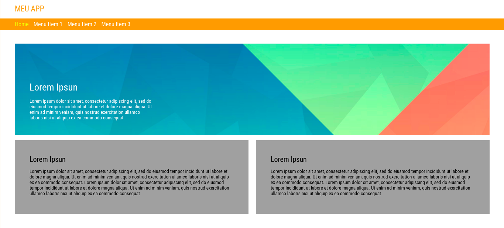
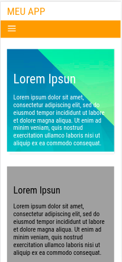
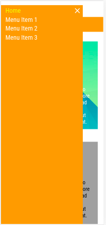

<h4 align="center">
  CLUSTER TESTE
</h4>

 1280X800 - PRINT VIEW
  
   

IPHONE - X PRINT VIEW
  
   

## FRONT END

- [React](https://reactjs.org)
- [Styled Components]

## Implantação - Observações

O Teste foi realizado nos browser's Chrome, Mozilla e Opera.
Foi utilizado o padrão de responsividade proposto pelo teste de 480px para dispositivos mobile.

- Os Links, páginas ativas ficam na cor amarelo.
  -o side-menu fica disponível apenas para dispositivos mobile, através do botão "hamburguer".
- O side-menu desliza da esquerda para direita.

## Project

Desafio Desenvolvimento:

Para o desenvolvimento, poderão ser utilizadas tecnologias web: HTML, CSS, JS ou outra(s). HTML e CSS são obrigatórios.
Frameworks de apoio (Bootstrap, Bulma) são permitidos, mas não obrigatórios.

    1. Fonte
    - Todas as fontes são "Roboto Condensed" (baixar do Google Fonts)

    2. Mobile
    - São considerados mobile dispositivos que possuam telas com largura menor que 480px.
    - A tela mobile deverá empilhar os conteúdos, ou seja, as colunas deverão virar linhas.
    - O menu deverá estar escondido, podendo ser aberto com um botão 'hamburger'.
    - O menu deverá ser aberto da esquerda para a direita. O layout do menu é de livre criação pelo candidato, desde que corresponda aos itens do menu desktop.

## Install

- Download and install: Node JS, React
- Clone ou download repositório
- cd na pasta cluster-test
- npm install or yarn para baixar as dependências. (preferência yarn para evitar conflitos)
- run yarn start ou npm start
